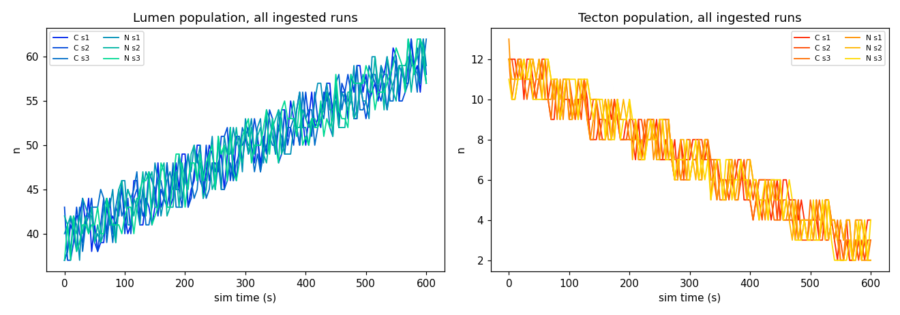
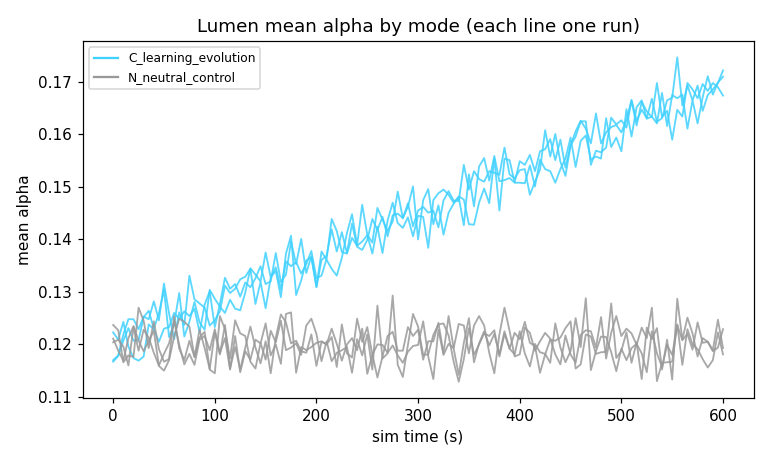

# Symbiotic Lab — session report 20260906_160643

**Lab generation:** 2   **Runs ingested:** 4   **Evidence objects:** 96

## Registry (the textbook)

| id | status | claim | proposer |
|---|---|---|---|
| H-001 | **caveat** | The wI interaction-reward weight (WeightInteraction=0.10) is what makes 'modify' learnable at all for a gamma=0 bandit; any modify-learning claim must state it. | Textbook |
| H-002 | **caveat** | Lifetime learning is a tabular contextual bandit with gamma=0 — it is not Q-learning and cannot credit delayed consequences on its own. | Textbook |
| H-003 | **caveat** | The genome parameter m (memory persistence) was dropped as redundant with alpha for a constant-step-size update; do not theorize about it. | Textbook |
| H-004 | **caveat** | The 2026-09-05 seed-stream change (4 Gaussians per birth, not 3) means runs recorded before it do not reproduce number-for-number with the same seed. | Textbook |
| H-005 | **conjecture** | Drought selects for higher epsilon in Lumen lineages. | Textbook |
| H-006 | **conjecture** | Tecton Trace Y engineering net-helps the Lumen population. | Textbook |
| H-007 | **conjecture** | High-e lineages win under drought but lose in times of plenty. | Textbook |
| H-008 | **conjecture** | Does the regen-6 stable band hold across seeds 1-5 at 1800 s? | Ada |
| H-009 | **conjecture** | Is turnover (births ~ deaths ~ 300 per 600 s) fast enough to see selection on alpha within a run? | Ada |
| H-010 | **conjecture** | Does drought at 0.3x regen from the regen-6 baseline cause a visible but survivable population dip? | Ada |

## Experiments

### X-001 — awaiting-sim
- card: H-009  ·  metric: `lumen_end_mean_alpha`  ·  threshold 0.01  ·  expected if true: treatment_higher
- arms: [C] vs [N], seeds [1, 2, 3], 900s
- preregistered predictions: Ada treatment_higher (0.45); Bastion no_difference (0.45); Fisher treatment_higher (0.45); Karla treatment_lower (0.45); Mendel treatment_higher (0.80); Vesper no_difference (0.75)

### X-002 — awaiting-sim
- card: H-010  ·  metric: `lumen_min_n`  ·  threshold 3.0  ·  expected if true: treatment_lower
- arms: [C +set 'Settings.PatchRegenPerSec=1.8'] vs [C], seeds [1, 2, 3], 900s
- preregistered predictions: Ada treatment_higher (0.45); Bastion treatment_lower (0.75); Fisher treatment_lower (0.45); Karla treatment_higher (0.45); Mendel treatment_higher (0.45); Vesper treatment_lower (0.45)

### X-003 — awaiting-sim
- card: H-008  ·  metric: `lumen_min_n`  ·  threshold 3.0  ·  expected if true: treatment_lower
- arms: [C +set 'Settings.PatchRegenPerSec=4'] vs [C], seeds [1, 2, 3], 900s
- preregistered predictions: Ada no_difference (0.45); Bastion treatment_lower (0.70); Fisher treatment_lower (0.60); Karla no_difference (0.45); Mendel treatment_higher (0.45); Vesper treatment_lower (0.45)

### X-004 — awaiting-sim
- card: H-007  ·  metric: `trace_y_end_mean`  ·  threshold 3.0  ·  expected if true: treatment_higher
- arms: [C +set 'Settings.PatchRegenPerSec=1.8'] vs [C], seeds [1, 2, 3], 900s
- preregistered predictions: Ada treatment_lower (0.45); Bastion treatment_higher (0.70); Fisher treatment_lower (0.45); Karla treatment_higher (0.45); Mendel treatment_higher (0.75); Vesper no_difference (0.45)

## Disputes

- **D-001** on H-009: Mendel, Ada, Fisher vs Vesper — open (experiment X-001)

## Lab evolution (agent parameters by generation)

| generation | agent | temperature | base confidence | fitness (mean Brier, prior gen) |
|---|---|---|---|---|
| 1 | Ada | 0.70 | 0.60 | — |
| 1 | Bastion | 0.70 | 0.65 | — |
| 1 | Fisher | 0.40 | 0.55 | — |
| 1 | Karla | 0.30 | 0.60 | — |
| 1 | Mendel | 0.50 | 0.70 | — |
| 1 | Vesper | 0.90 | 0.75 | — |
| 2 | Ada | 0.70 | 0.60 | — |
| 2 | Bastion | 0.70 | 0.65 | — |
| 2 | Fisher | 0.40 | 0.55 | — |
| 2 | Karla | 0.30 | 0.60 | — |
| 2 | Mendel | 0.50 | 0.70 | — |
| 2 | Vesper | 0.90 | 0.75 | — |

## Open questions

- OQ-1 (open): Does the regen-6 stable band hold across seeds 1-5 at 1800 s?
- OQ-2 (open): Is turnover (births ~ deaths ~ 300 per 600 s) fast enough to see selection on alpha within a run?
- OQ-3 (open): Does drought at 0.3x regen from the regen-6 baseline cause a visible but survivable population dip?

## Awaiting the sim machine

Run these on the machine with UE 5.7, then `python -m Lab.lab run-queued`:

```
python Tools/run_sim.py --mode C --seed 1 2 3 --duration 900   # X-001 arm
python Tools/run_sim.py --mode N --seed 1 2 3 --duration 900   # X-001 arm
python Tools/run_sim.py --mode C --seed 1 2 3 --duration 900 --set "Settings.PatchRegenPerSec=1.8"   # X-002 arm
python Tools/run_sim.py --mode C --seed 1 2 3 --duration 900   # X-002 arm
python Tools/run_sim.py --mode C --seed 1 2 3 --duration 900 --set "Settings.PatchRegenPerSec=4"   # X-003 arm
python Tools/run_sim.py --mode C --seed 1 2 3 --duration 900   # X-003 arm
python Tools/run_sim.py --mode C --seed 1 2 3 --duration 900 --set "Settings.PatchRegenPerSec=1.8"   # X-004 arm
python Tools/run_sim.py --mode C --seed 1 2 3 --duration 900   # X-004 arm
```

## Minutes

**Meeting 1** (regular, 2026-09-06T19:45:42+00:00): Meeting 1. 9 findings presented (Bastion, Mendel, Vesper). New cards: H-008, H-009. H-009 stances: 3A/1D/2Ab. H-008 stances: 3A/0D/3Ab. H-007 stances: 3A/0D/3Ab. H-006 stances: 3A/0D/3Ab. Disputes docketed: D-001. Experiment X-001 queued with preregistered predictions.
**Meeting 2** (generation-boundary, 2026-09-06T19:45:42+00:00): Meeting 2. 9 findings presented (Bastion, Mendel, Vesper). New cards: H-010. H-010 stances: 3A/0D/3Ab. H-009 stances: 3A/1D/2Ab. H-008 stances: 3A/0D/3Ab. H-007 stances: 3A/0D/3Ab. Experiment X-002 queued with preregistered predictions.
**Meeting 3** (regular, 2026-09-06T20:06:43+00:00): Meeting 3. 9 findings presented (Bastion, Mendel, Vesper). H-010 stances: 3A/0D/3Ab. H-009 stances: 3A/1D/2Ab. H-008 stances: 3A/0D/3Ab. H-007 stances: 3A/0D/3Ab. Experiment X-003 queued with preregistered predictions.
**Meeting 4** (generation-boundary, 2026-09-06T20:06:43+00:00): Meeting 4. 9 findings presented (Bastion, Mendel, Vesper). H-010 stances: 3A/0D/3Ab. H-009 stances: 3A/1D/2Ab. H-008 stances: 3A/0D/3Ab. H-007 stances: 3A/0D/3Ab. Experiment X-004 queued with preregistered predictions.

## Data annex — Vega (non-voting)

_Charts and trend forecasts computed directly from the run telemetry. This annex is for the reader; the scientists neither see nor cite it._



