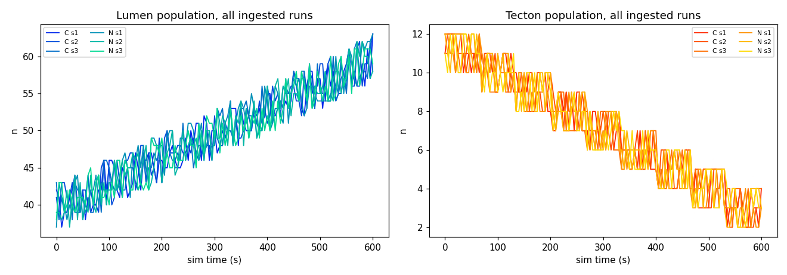
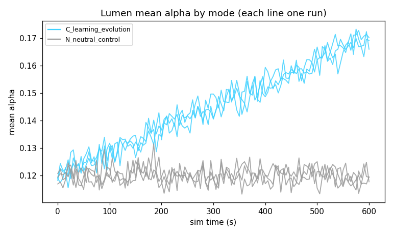

# Symbiotic Lab — session report sample_fixture_demo

**Lab generation:** 3   **Runs ingested:** 6   **Evidence objects:** 184

## Registry (the textbook)

| id | status | claim | proposer |
|---|---|---|---|
| H-001 | **caveat** | The wI interaction-reward weight (WeightInteraction=0.10) is what makes 'modify' learnable at all for a gamma=0 bandit; any modify-learning claim must state it. | Textbook |
| H-002 | **caveat** | Lifetime learning is a tabular contextual bandit with gamma=0 — it is not Q-learning and cannot credit delayed consequences on its own. | Textbook |
| H-003 | **caveat** | The genome parameter m (memory persistence) was dropped as redundant with alpha for a constant-step-size update; do not theorize about it. | Textbook |
| H-004 | **caveat** | The 2026-09-05 seed-stream change (4 Gaussians per birth, not 3) means runs recorded before it do not reproduce number-for-number with the same seed. | Textbook |
| H-005 | **conjecture** | Drought selects for higher epsilon in Lumen lineages. | Textbook |
| H-006 | **conjecture** | Tecton Trace Y engineering net-helps the Lumen population. | Textbook |
| H-007 | **conjecture** | High-e lineages win under drought but lose in times of plenty. | Textbook |
| H-008 | **conjecture** | A staged reintroduction of Tecton is warranted: recent runs show the Tecton population floor collapsing, and if assessment finds resource headroom, introducing additional founders would raise the population floor without starving the rest of the valley. | Docket |
| H-009 | **conjecture** | Does the regen-6 stable band hold across seeds 1-5 at 1800 s? | Ada |
| H-010 | **supported** | Is turnover (births ~ deaths ~ 300 per 600 s) fast enough to see selection on alpha within a run? | Ada |
| H-011 | **conjecture** | Does drought at 0.3x regen from the regen-6 baseline cause a visible but survivable population dip? | Ada |

## Experiments

### X-001 — done (pass)
- card: H-008  ·  metric: `resource_B_end`  ·  threshold 0.0  ·  expected if true: treatment_higher
- arms: [C] vs [C], seeds [1, 2], 600s
- result: {"metric": "resource_B_end", "mean": 764.0, "criteria_min": 250.0, "n": 3, "kind": "assessment"}

### X-002 — done (pass)
- card: H-010  ·  metric: `lumen_end_mean_alpha`  ·  threshold 0.01  ·  expected if true: treatment_higher
- arms: [C] vs [N], seeds [1, 2, 3], 900s
- result: treatment 0.1684 vs control 0.1188 (diff +0.04953) -> treatment_higher
- preregistered predictions: Ada treatment_higher (0.45, Brier 0.45); Bastion no_difference (0.45, Brier 0.80); Fisher treatment_higher (0.45, Brier 0.45); Karla treatment_lower (0.45, Brier 0.80); Mendel treatment_higher (0.80, Brier 0.06); Vesper no_difference (0.75, Brier 1.34)

### X-003 — awaiting-sim
- card: H-011  ·  metric: `lumen_min_n`  ·  threshold 3.0  ·  expected if true: treatment_lower
- arms: [C +set 'Settings.PatchRegenPerSec=1.8'] vs [C], seeds [1, 2, 3], 900s
- preregistered predictions: Ada treatment_higher (0.45); Bastion treatment_lower (0.75); Fisher treatment_lower (0.45); Karla treatment_higher (0.45); Mendel treatment_higher (0.45); Vesper treatment_lower (0.45)

### X-004 — awaiting-sim
- card: H-009  ·  metric: `lumen_min_n`  ·  threshold 3.0  ·  expected if true: treatment_lower
- arms: [C +set 'Settings.PatchRegenPerSec=4'] vs [C], seeds [1, 2, 3], 900s
- preregistered predictions: Ada no_difference (0.45); Bastion treatment_lower (0.70); Fisher treatment_lower (0.60); Karla no_difference (0.45); Mendel treatment_higher (0.45); Vesper treatment_lower (0.45)

### X-005 — done (fail)
- card: H-008  ·  metric: `tecton_end_n`  ·  threshold 3.0  ·  expected if true: treatment_higher
- arms: [C +set 'Settings.InitialTecton=24'] vs [C], seeds [1, 2, 3], 900s
- result: treatment 3.667 vs control 3 (diff +0.6667) -> no_difference
- preregistered predictions: Ada treatment_lower (0.45, Brier 0.80); Bastion treatment_higher (0.85, Brier 1.58); Fisher treatment_higher (0.65, Brier 1.13); Karla no_difference (0.60, Brier 0.24); Mendel no_difference (0.70, Brier 0.14); Vesper treatment_higher (0.80, Brier 1.46)

### X-006 — awaiting-sim
- card: H-010  ·  metric: `lumen_end_mean_alpha`  ·  threshold 0.01  ·  expected if true: treatment_higher
- arms: [C] vs [N], seeds [1, 2, 3], 900s
- preregistered predictions: Ada treatment_higher (0.45); Bastion no_difference (0.45); Fisher treatment_higher (0.45); Karla treatment_lower (0.45); Mendel treatment_higher (0.80); Vesper no_difference (0.75)

## Disputes

- **D-001** on H-010: Mendel, Ada, Fisher vs Vesper — resolved:pass (experiment X-002)
- **D-002** on H-010: Mendel, Ada, Fisher vs Vesper — open (experiment X-006)

## Conservation programs

- **P-001** (Tecton, card H-008): **done** — assessment X-001, introduction X-005

_Stage 1 assesses resource headroom in code before any introduction; introduction is run-level (boosted founders at t=0) because the sim has no mid-run spawn verb._

## Lab evolution (agent parameters by generation)

| generation | agent | temperature | base confidence | fitness (mean Brier, prior gen) |
|---|---|---|---|---|
| 1 | Ada | 0.70 | 0.60 | — |
| 1 | Bastion | 0.70 | 0.65 | — |
| 1 | Fisher | 0.40 | 0.55 | — |
| 1 | Karla | 0.30 | 0.60 | — |
| 1 | Mendel | 0.50 | 0.70 | — |
| 1 | Vesper | 0.90 | 0.75 | — |
| 2 | Ada | 0.70 | 0.60 | 0.45 |
| 2 | Bastion | 0.70 | 0.65 | 0.80 |
| 2 | Fisher | 0.40 | 0.55 | 0.45 |
| 2 | Karla | 0.30 | 0.60 | 0.80 |
| 2 | Mendel | 0.50 | 0.70 | 0.06 |
| 2 | Vesper | 0.82 | 0.71 | 1.34 |
| 3 | Ada | 0.70 | 0.60 | 0.63 |
| 3 | Bastion | 0.56 | 0.65 | 1.19 |
| 3 | Fisher | 0.40 | 0.55 | 0.79 |
| 3 | Karla | 0.30 | 0.60 | 0.52 |
| 3 | Mendel | 0.50 | 0.70 | 0.10 |
| 3 | Vesper | 0.76 | 0.58 | 1.40 |

## Credibility (Brier-updated vote weights)

| agent | domain | weight | scored |
|---|---|---|---|
| Ada | behavior | 0.52 | 2 |
| Ada | ecology | 0.52 | 2 |
| Ada | genetics | 0.52 | 2 |
| Bastion | ecology | 0.36 | 2 |
| Fisher | behavior | 0.52 | 2 |
| Fisher | ecology | 0.52 | 2 |
| Karla | behavior | 0.61 | 2 |
| Karla | ecology | 0.61 | 2 |
| Karla | genetics | 0.61 | 2 |
| Mendel | genetics | 1.43 | 2 |
| Vesper | behavior | 0.33 | 2 |

## Open questions

- OQ-1 (open): Does the regen-6 stable band hold across seeds 1-5 at 1800 s?
- OQ-2 (open): Is turnover (births ~ deaths ~ 300 per 600 s) fast enough to see selection on alpha within a run?
- OQ-3 (open): Does drought at 0.3x regen from the regen-6 baseline cause a visible but survivable population dip?

## Awaiting the sim machine

Run these on the machine with UE 5.7, then `python -m Lab.lab run-queued`:

```
python Tools/run_sim.py --mode C --seed 1 2 3 --duration 900 --set "Settings.PatchRegenPerSec=1.8"   # X-003 arm
python Tools/run_sim.py --mode C --seed 1 2 3 --duration 900   # X-003 arm
python Tools/run_sim.py --mode C --seed 1 2 3 --duration 900 --set "Settings.PatchRegenPerSec=4"   # X-004 arm
python Tools/run_sim.py --mode C --seed 1 2 3 --duration 900   # X-004 arm
python Tools/run_sim.py --mode C --seed 1 2 3 --duration 900   # X-006 arm
python Tools/run_sim.py --mode N --seed 1 2 3 --duration 900   # X-006 arm
```

## Minutes

**Meeting 1** (regular, 2026-09-06T18:00:36+00:00): Meeting 1. 9 findings presented (Bastion, Mendel, Vesper). New cards: H-009, H-010. H-010 stances: 3A/1D/2Ab. H-009 stances: 3A/0D/3Ab. H-008 stances: 3A/2D/1Ab. H-007 stances: 3A/0D/3Ab. Disputes docketed: D-001. Experiment X-002 queued with preregistered predictions.
**Meeting 2** (regular, 2026-09-06T18:00:36+00:00): Meeting 2. 9 findings presented (Bastion, Mendel, Vesper). New cards: H-011. H-011 stances: 3A/0D/3Ab. H-010 stances: 3A/1D/2Ab. H-009 stances: 3A/0D/3Ab. H-008 stances: 3A/2D/1Ab. Experiment X-003 queued with preregistered predictions.
**Meeting 3** (generation-boundary, 2026-09-06T18:00:36+00:00): Meeting 3. 9 findings presented (Bastion, Mendel, Vesper). H-011 stances: 3A/0D/3Ab. H-010 stances: 3A/1D/2Ab. H-009 stances: 3A/0D/3Ab. H-008 stances: 3A/2D/1Ab. Experiment X-004 queued with preregistered predictions.
**Meeting 4** (generation-boundary, 2026-09-06T18:00:37+00:00): Meeting 4. 7 findings presented (Bastion, Mendel, Vesper). H-011 stances: 3A/0D/3Ab. H-010 stances: 3A/1D/2Ab. H-009 stances: 3A/0D/3Ab. H-008 stances: 3A/2D/1Ab. Disputes docketed: D-002. Experiment X-006 queued with preregistered predictions.
**Meeting 5** (generation-boundary, 2026-09-06T18:00:39+00:00): Meeting 5. 7 findings presented (Bastion, Mendel, Vesper). H-011 stances: 3A/0D/3Ab. H-010 stances: 3A/1D/2Ab. H-009 stances: 3A/0D/3Ab. H-008 stances: 3A/2D/1Ab.

## Data annex — Vega (non-voting)

_Charts and trend forecasts computed directly from the run telemetry. This annex is for the reader; the scientists neither see nor cite it._




| run | metric | horizon (s) | forecast | 95% band | actual |
|---|---|---|---|---|---|
| FIXTURE_C_learning_evolution_s1 | lumen_mean_alpha | 900 | 0.194 | [0.188, 0.201] | — |
| FIXTURE_C_learning_evolution_s1 | lumen_n | 900 | 68.9 | [65.1, 72.7] | — |
| FIXTURE_C_learning_evolution_s1 | tecton_mean_alpha | 900 | 0.118 | [0.111, 0.125] | — |
| FIXTURE_C_learning_evolution_s1 | tecton_n | 900 | -1.55 | [-3.49, 0.39] | — |
| FIXTURE_C_learning_evolution_s2 | lumen_mean_alpha | 900 | 0.2 | [0.195, 0.206] | — |
| FIXTURE_C_learning_evolution_s2 | lumen_n | 900 | 70.8 | [67.1, 74.6] | — |
| FIXTURE_C_learning_evolution_s2 | tecton_mean_alpha | 900 | 0.12 | [0.116, 0.125] | — |
| FIXTURE_C_learning_evolution_s2 | tecton_n | 900 | -2.2 | [-3.88, -0.515] | — |
| FIXTURE_C_learning_evolution_s3 | lumen_mean_alpha | 900 | 0.194 | [0.187, 0.2] | — |
| FIXTURE_C_learning_evolution_s3 | lumen_n | 900 | 68.2 | [64.2, 72.2] | — |
| FIXTURE_C_learning_evolution_s3 | tecton_mean_alpha | 900 | 0.119 | [0.113, 0.126] | — |
| FIXTURE_C_learning_evolution_s3 | tecton_n | 900 | -0.492 | [-2.32, 1.34] | — |
| FIXTURE_N_neutral_control_s1 | lumen_mean_alpha | 900 | 0.12 | [0.114, 0.126] | — |
| FIXTURE_N_neutral_control_s1 | lumen_n | 900 | 69.4 | [64.9, 74] | — |
| FIXTURE_N_neutral_control_s1 | tecton_mean_alpha | 900 | 0.118 | [0.112, 0.124] | — |
| FIXTURE_N_neutral_control_s1 | tecton_n | 900 | -2.39 | [-4.17, -0.613] | — |
| FIXTURE_N_neutral_control_s2 | lumen_mean_alpha | 900 | 0.121 | [0.115, 0.126] | — |
| FIXTURE_N_neutral_control_s2 | lumen_n | 900 | 70 | [66.1, 73.9] | — |
| FIXTURE_N_neutral_control_s2 | tecton_mean_alpha | 900 | 0.12 | [0.114, 0.127] | — |
| FIXTURE_N_neutral_control_s2 | tecton_n | 900 | -1.63 | [-3.47, 0.206] | — |
| FIXTURE_N_neutral_control_s3 | lumen_mean_alpha | 900 | 0.117 | [0.111, 0.122] | — |
| FIXTURE_N_neutral_control_s3 | lumen_n | 900 | 70.9 | [66.9, 75] | — |
| FIXTURE_N_neutral_control_s3 | tecton_mean_alpha | 900 | 0.12 | [0.114, 0.127] | — |
| FIXTURE_N_neutral_control_s3 | tecton_n | 900 | -1.51 | [-3.34, 0.32] | — |
