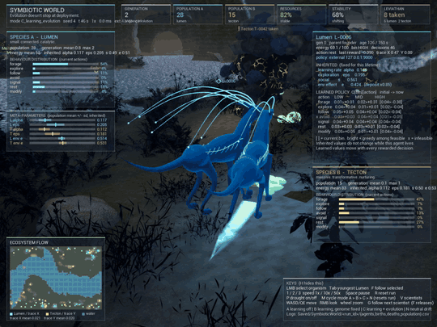
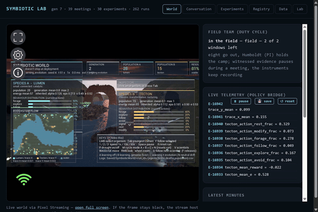
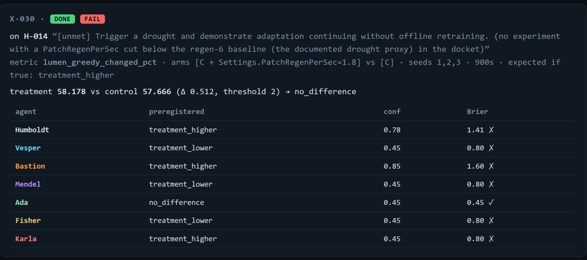
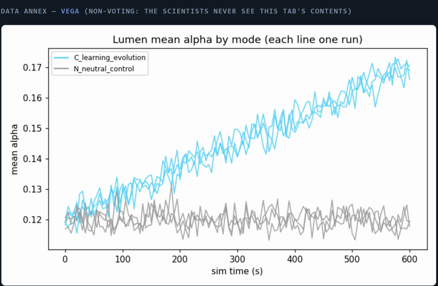

# Symbiotic World

Sundai Hack 139 entry. A persistent 3D ecosystem in Unreal Engine 5.7 with two
populations of primitive learning agents, **Lumen** (fast cyan scouts) and
**Tecton** (slow amber ecosystem engineers). Every individual learns online
during its lifetime with a tabular contextual bandit; descendants inherit
mutated learning parameters (α, ε, social) and an environmental-effect strength (e). The claim the demo has to earn:
*training was only generation zero.*

Spec: `docs/SPEC_TEXT.txt` (text of the hack-day specification; concept plates in
`docs/plates/`). Mechanism definitions: `DESIGN.md`.
Build plan with exit conditions: `CHECKLIST.md`.
Contributing (Mac collaborators, coding agents, recipes for actions/percepts/species/learners/perturbations/analysis): `docs/CONTRIBUTING.md`.

## Demo videos

Both are scripted takes: a seeded run plus a shot list fired at exact logical times, so
re-running the same seed and list reproduces the take (see "Recorded takes" below). The loops
below play in place; each links to its full take, which GitHub opens in its own player.

### The world — 4 min ([docs/videos/symbiotic_world_demo.mp4](docs/videos/symbiotic_world_demo.mp4))

[](docs/videos/symbiotic_world_demo.mp4)

Seed 4, mode C. The loop is the beat the whole project rests on: one Lumen selected, the
inspector showing what it inherited (learning rate, exploration, social, env effect - fixed for
this lifetime) beside a learned policy whose values move with every rewarded decision. The full
take adds the Leviathan hunting the river channel, 50x while generations turn over and each
inherits its parent's learning rate mutated, and a drought at 1x with the HUD hidden.

### The lab — 4m44s ([docs/videos/symbiotic_lab_demo.mp4](docs/videos/symbiotic_lab_demo.mp4))

[](docs/videos/symbiotic_lab_demo.mp4)

The Symbiotic Lab dashboard with the same world streaming live inside its World tab: the
field team's duty cycle, a meeting forming in real time, an experiment's protocol with its
measured arms and the predictions every scientist preregistered before the run, the
registry, and Vega's charts.

## Requirements

- Unreal Engine 5.7 (installed at `C:\Program Files\Epic Games\UE_5.7`)
- Visual Studio 2022 17.8+ or Visual Studio 2026 with the
  "Game development with C++" workload (VS 2026 / MSVC 14.50 verified)
- Python 3 with pandas, matplotlib, scipy for the analysis scripts
  (`python` works)

## Build

```bash
Tools/build.bat
```

It wraps the engine's `Build.bat` (SymbioticWorldEditor Win64 Development) and refuses to
run while any `UnrealEditor` / `UnrealEditor-Cmd` process exists: the module DLL is locked,
the link fails, and replacing the DLL under a live session crashes it. Pass
`-DisableAdaptiveUnity` when a build's codegen must match a clean checkout's exactly
(UBT compiles git-modified files outside the unity blob, which has produced runs that
differ from the same seed built the other way).

First build ~2 min, incremental ~10 s. Then double-click `SymbioticWorld.uproject`
or open it from the Epic launcher. The startup map is `/Game/Maps/Valley`
(deliberately empty: the game mode spawns floor, sun, sky, fog and the world
manager at runtime). Press Play.

If `Content/Maps/Valley.umap` is missing, recreate it:

```bash
"C:/Program Files/Epic Games/UE_5.7/Engine/Binaries/Win64/UnrealEditor-Cmd.exe" "%CD%/SymbioticWorld.uproject" -run=pythonscript -script="%CD%/Tools/make_valley_map.py"
```

## Controls

| Key | Action |
|---|---|
| LMB | select organism (opens inspector) |
| Tab | select the youngest Lumen |
| F | follow selected organism |
| 1 / 2 / 3 | 1× / 10× / 50× logical time |
| Space | pause |
| P | drought on/off |
| M | cycle mode A → B → C → N (resets run) |
| R | reset run (same seed) |
| H | hide/show help |
| V | scientist avatars on/off (field team of a `Lab.lab observe --embody` bridge; visual only, off by default) |
| G | follow the next scientist (cycles the field team in join order; F or any camera move releases) |
| WASD / QE, RMB drag, wheel | camera |

Modes: **A** learning off (α = 0) · **B** learning on, genome fixed ·
**C** learning + evolution · **N** neutral-drift control (random parent, no
starvation death). C must separate from N across seeds before you may claim
selection on learning parameters.

## Headless runs and analysis (closed loop)

```bash
python Tools/run_sim.py --mode B --seed 42 --duration 300 --analyze
python Tools/run_sim.py --mode C N --seed 1 2 3 --duration 900 --analyze
python Analysis/analyze_run.py --root Saved/SymbioticWorld
python Tools/sweep.py --mode C --seed 1 2 --duration 600 --baseline --set "Settings.PatchRegenPerSec=6"
python Tools/run_sim.py --mode C --seed 1 --duration 45 --speed 1 --windowed --shot 4,40 --auto-select --no-logs
```

`sweep.py` runs one headless sim per (override spec × mode × seed) and prints
min/final population, starvation deaths, max generation and end-of-run mean α
per row, plus a CSV in `Saved/`. `run_sim.py --windowed --shot` makes the sim
screenshot itself (closed-loop visual check without a human at the keyboard).

Each run writes `Saved/SymbioticWorld/<run_id>/{agents,births,deaths,population}.csv`
(Appendix A fields plus mode, energy bin, explore flag and the full 3×7 Q
table) and quits itself at `--duration` logical seconds. Since 2026-09-06
`agents.csv` ends with a `policy` column (`builtin`, or `ext:host:port` when an
external policy server chooses that organism's actions) and `population.csv`
ends with `ext_decisions,ext_fallbacks` (cumulative per species: decisions taken
from a server / server-assigned decisions the built-in bandit had to make). Both
are constant (`builtin`, `0,0`) in runs without `--policy`. `analyze_run.py`
prints lifetime Q drift per agent, parent/child genome correlation,
per-generation means, and a Welch test of C vs N end-of-run mean α, plus a
summary PNG per run.

Command-line flags understood by the sim (all optional):

```
-SWMode=A|B|C|N   -SWSeed=42   -SWSpeed=200   -SWDuration=600   -SWNoLogs=1
-SWSet="Settings.PatchRegenPerSec=5;Lumen.ReproThreshold=85;Tecton.MaxAge=400;Genome.Alpha=0.15"
-SWShot=5:60:120        # screenshots to Saved/Screenshots at these sim times (needs rendering; ':' because UE stops parsing at ',')
-SWAutoSelect=1         # select the youngest Lumen at start so screenshots show the inspector
-SWCam=x:y:z:pitch:yaw  # start camera for scripted shots (run_sim: --cam=x,y,z,pitch,yaw)
-SWSet="Look.bAuthoredCreatures=0"             # procedural creature bodies instead of the authored Lumen/Tecton skeletal meshes (docs/CREATURE_RENDERING.md)
-SWFollowSpecies=Lumen|Tecton|Leviathan         # chase camera on the selected organism of that species (selecting one if needed), or on the river predator; any camera key releases it
-SWFollowScientist=Vesper|any                   # chase camera on a field-team scientist once the avatar joins (needs Look.bScientistAvatars=1 and an --embody bridge); key G cycles the team live
-SWCreatureAudit                                # log creature pose-update ms + foot reach error at each -SWShot time
-RenderOffScreen        # run_sim: --offscreen; renders and screenshots without a visible window,
                        # so a scripted render never captures your keystrokes (M/P/1-3 would change the run)
-SWPolicy="host:port=Lumen|host:port=Tecton"   # external policy servers (run_sim: --policy); '|' and '=' only, no ',' or ';'
-SWPolicyTimeoutMs=200  -SWPolicyShare=1.0     # run_sim: --policy-timeout / --policy-share; see docs/POLICY_API.md
-SWSet="Settings.PolicyTimeoutBackoffAfter=3;Settings.PolicyBackoffStartSec=1;Settings.PolicyBackoffMaxSec=10"   # a server that misses 3 replies in a row is left alone (its organisms use the built-in bandit) and retried on a growing interval, so a wedged bridge never slows the world
-SWSet="Settings.bLeviathan=1"                  # river predator (off by default; DESIGN.md §4); live: control "set Settings.bLeviathan=1" then "reset"
-SWSet="Look.bScientistAvatars=1"               # Symbiotic Lab field-team avatars (visual only, off by default; docs/POLICY_API.md §5); live: control "set Look.bScientistAvatars=1"
-SWPolicyFile=Saved/policy_servers.txt         # server list file polled every 3 s while running (run_sim: --policy-file); edit it to add/remove servers
-SWControlFile=Saved/control.txt               # live control file polled every 2 s (run_sim: --control-file): append "drought=on", "set Lumen.MaxAge=200", "reset seed=3" ... (docs/CONTROL_FILE.md)
-SWSet="Look.bShowHUD=0"                       # hide the whole HUD for clean framing (live: control "set Look.bShowHUD=0"); scenario captions still draw
-SWSet="Look.CaptionSeconds=10"                # how long a control "caption=<text>" title stays up (Look.bShowCaptions=0 turns the layer off)
-SWSet="Look.bPredationEffects=0"              # no blood plume, sinking body, kill feed or minimap mark on a predation kill (default on)
-SWSet="Look.bShowLabPanel=1"                  # SYMBIOTIC LAB panel in the sim's HUD (the bridge's own log lines; OFF by default, the lab's dashboard `python -m Lab.lab ui` is the normal way to watch it)
```

`run_sim.py --windowed` opens a 1600x900 window; `--res WxH` (e.g. `--res 1920x1080`) changes it, which is
what a screen recorder captures.

`-SWSet` reaches any numeric/bool/colour/string field of `FSWRunSettings` (scope `Settings`),
`FSWSpeciesParams` (`Lumen` / `Tecton`), the founder `FSWGenome` (`Genome`) or the
visual `FSWLookSettings` (`Look`, colours as `r:g:b`) by name, so parameter and look
sweeps never need a recompile. Field names are in `Source/SymbioticWorld/SWTypes.h`.
Look examples: `Look.SunPitch=-6;Look.SunYaw=176;Look.FillIntensity=0.9` (lighting rig:
sun + shadowless fill), `Look.ArchCount=3` (massif sandstone arches), `Look.bCliffWalls=true`
(rim walls, off by default), `Look.RiverBranches=0` (main channel only; default 2 tributaries),
`Settings.WorldHalfSizeY=8000` (square arena again), `Look.bDroughtPreview=true`,
`Look.bArchFalls=false` (waterfalls off the arch crowns), `Look.FogMaxOpacity=0.7` (below 1 the
sun and sky show through the horizon haze), `Look.TraceOverlayIntensity=0.55` (ground trace
stains), `Look.WaterBrightness=0.6`, `Look.bMoon=false`, `Look.AuthoredTectonScale=3.0` (authored creature size,
docs/CREATURE_RENDERING.md).

Materials that go onto instanced components (`M_SW_Scan`, `M_SW_Rock`, `M_SW_Glow`) carry
`used_with_instanced_static_meshes`; without it the runtime logs
`missing bUsedWithInstancedStaticMeshes=True` and silently draws the default grey material.

Generated materials live in `Content/Materials` and are rebuilt from
`Tools/make_materials.py` (`M_SW_Terrain/Rock/Water/Creature/Glow/Trail/Waterfall/Moon`,
`M_SW_TerrainED` from the migrated Megascans surface sets, `M_SW_Sandstone` for the
arches, and `M_SW_Scan`, which the environment binds at spawn to every Electric Dreams
scan mesh from its own Albedo/Normal/DR textures). Delete a `.uasset` and re-run the
generator to rebuild it; then grep `Saved/Logs/SymbioticWorld.log` for
`Failed to compile Material`, which is how a bad sampler type shows up.

## Bring your own agent (Python, any OS)

Collaborators on the same wifi write their own agents in Python and have them
control organisms inside the one world running on the Windows host. No Unreal, no
pip installs: `Tools/policy_server.py` is standard library only (Python 3.9+, runs on
macOS). The sim connects to *their* machine, sends each organism's percept, feasibility
mask and its own bandit table once per decision, and acts on the reply; anything late
or infeasible falls back to the organism's built-in bandit and is counted. Protocol,
field list and fallback rules: `docs/POLICY_API.md`. To go beyond the policy API and
change the sim itself (C++ the host builds for you): `docs/CONTRIBUTING.md`.

On the Mac (4 commands, nothing to install):

```bash
git clone <this repo> && cd Symbiotic_Word_3D          # or just copy Tools/policy_server.py
python3 Tools/policy_server.py --agent my --port 9000   # edit MyAgent.act() in that file; see the agent list below
python3 Tools/policy_client_check.py --port 9000        # optional self-test from a second terminal
ipconfig getifaddr en0                                  # tell the host this IP
```

Example agents in `Tools/policy_server.py` (`--agent`):

* `random`: uniform over the feasible actions, the floor to beat.
* `bandit`: the sim's own tabular contextual bandit (γ = 0) re-implemented in Python, α/ε from the genome.
* `heuristic`: fixed rules on the percept (forage when food is known and energy is not HIGH, avoid other-species neighbours when LOW, rest when LOW with nothing known, else explore).
* `tracefollower`: Lumen follow up a strong Trace X gradient, Tecton modify (Trace Y) on land at HIGH energy, else forage/explore.
* `my`: yours.

No Unreal on your machine? `python3 Tools/policy_server.py --record run.jsonl` logs every
exchange, `python3 Tools/policy_replay.py --agent my --file docs/samples/decide_sample.jsonl`
replays a recording against your class offline (mask violations, action distribution,
timing), and the repo ships a 300-exchange sample. See "Offline development on a Mac" in
`docs/POLICY_API.md`.

On the host, while the sim runs (no restart): add one line per server to
`Saved/policy_servers.txt` and save. The sim polls the file every 3 s, connects new servers,
closes removed ones and rebinds organisms (`docs/POLICY_API.md`, "Adding servers while the
sim runs"; template `Tools/policy_servers.example.txt`). `Tools/policy_probe.py` finds the
servers on the wifi and can append them for you:

```bash
python Tools/policy_probe.py --write Saved/policy_servers.txt   # scans the host's own /24 for port 9000, appends "host:port=Both" lines
python Tools/run_sim.py --mode C --seed 7 --duration 600 --speed 20 --windowed                     # the default file is watched automatically
python Tools/run_sim.py --mode C --seed 7 --duration 600 --speed 20 --windowed --policy "10.228.152.5:9000=Lumen|10.228.152.7:9000=Tecton"   # launch-time alternative
```

Species per server: `Lumen`, `Tecton` or `Both`; several servers share one world. The
HUD title shows `ext N/M` (organisms currently bound to a server / total), the inspector shows
`policy: external host:port`, and the UE log prints connect / hello / timeout lines
once per state change plus a round-trip summary every 10 s. Allow `UnrealEditor.exe`
through Windows Firewall on private networks if the host cannot reach a Mac.

## Watching and driving the sim from other computers (Pixel Streaming)

The sim runs once, on the Windows machine; anyone on the same network watches and
controls it from a browser (Chrome or Safari, including Macs). One-time setup:
fetch Epic's signalling server with the engine's script
`Engine/Plugins/Media/PixelStreaming2/Resources/WebServers/get_ps_servers.bat`
(the `PixelStreaming2` plugin is enabled in the `.uproject`). Then, in two terminals:

```bash
Tools\start_stream_server.bat
Tools\stream_keepalive.bat
```

`stream_keepalive.bat` runs `run_sim.py --stream --offscreen` for the day and relaunches it
after any exit (create `Saved\stop_stream` to stop the loop). Viewers open
`http://<host LAN IP>/?AFKDetection=false&HoveringMouse=true` and click to start. The two
parameters matter: the player page's idle timeout disconnects a still viewer after 120 s and
that disconnect has aborted the Pixel Streaming media layer three times (exit 0xC0000409,
no crash report); hovering-mouse mode makes clicks select organisms instead of grabbing the
camera. Mouse and keyboard from the
browser reach the sim (select, follow, drought, speed, camera), so agree on one driver at a
time. Allow `node.exe` on private networks when Windows Firewall asks. The stream is
encoded on the host GPU (NVENC on NVIDIA); hackathon wifi that isolates clients from each
other blocks it, in which case fall back to screen sharing.

To perturb the running world from a script or a second terminal instead of its keyboard (drought,
speed, pause, any `--set` parameter, reset, mode), append lines to `Saved/control.txt`:
`python Tools/control.py "drought=on"`; every executed command is logged to the run's `commands.csv`.
Grammar and which settings take effect live: `docs/CONTROL_FILE.md`.

## Recorded takes

A demo video is a scripted take, not a live performance: start a rendering run, append the whole shot list
to its control file, and record the screen with ffmpeg. Game Bar is not usable here - it recorded nothing
on this machine - and neither are window-targeted captures of a GPU-composited window, which come back
black. What works is a desktop capture of a window that has been raised and pinned:

```bash
ffmpeg -f gdigrab -framerate 30 -draw_mouse 0 -offset_x 0 -offset_y 0 -video_size 2400x1600        -i desktop -t 240 -c:v h264_nvenc -preset p5 -cq 23 -pix_fmt yuv420p -an take.mp4
```

Three things cost whole takes before this was written down: `run_sim.py --no-console` (without it the
engine's log console floats over the frame), never resizing the window after launch (the HUD lays out
for the render size, so a forced resize crops its right column - pick `--res` to fit instead), and the
fact that a desktop capture records whatever is in FRONT. Pinning a window `HWND_TOPMOST` is not enough,
because Windows denies `SetForegroundWindow` to a process that is not already the foreground app; a take
recorded four minutes of an unrelated app's title bar that way. Raise the window first (drop
`SPI_SETFOREGROUNDLOCKTIMEOUT`, attach the foreground thread's input queue, tap Alt), then pin it, then
refuse to record unless the window you want reads back as the foreground process - and verify the result
from the recording itself (a frame per segment) rather than from the script's exit code.

```bash
python Tools/run_sim.py --mode C --seed 1 --duration 400 --speed 1 --windowed --res 1920x1080 --control-file Saved/take1.txt
python Tools/control.py --file Saved/take1.txt "at=58 caption=Drought: the river drops" "at=60 drought=on" "at=90 follow=Leviathan" "at=120 cam=-3000,900,420,-8,10" "at=150 set Look.bShowHUD=0"
```

`at=<sim_time> <command>` runs any control command at an exact **logical** time, so the same seed and shot
list produce the same take twice; `cam=x,y,z,pitch,yaw` places the camera, `follow=Lumen|Tecton|Leviathan|<scientist>|none`
frames a subject, `caption=<text>` announces the scenario with a large title in the lower third for
`Look.CaptionSeconds` (6 s; `set Look.bShowCaptions=0` turns the layer off), and `set Look.bShowHUD=0` hides
the HUD — captions keep drawing, so a clean-framed take still carries its narration (all of these are
camera/HUD only and change nothing in the world). The pending list is cleared by `reset` / `mode=`, so an old shot never re-fires into a new run.
`commands.csv` records each scheduled command at the sim time it actually ran. Append the shot list **after**
the sim starts: lines that already exist in the file when it launches are ignored.

## Scientist agents: experiment service

`python Tools/experiment_service.py` (host, port 8800, no authentication: LAN only) turns the
closed loop into a JSON API for scientist agents on other machines: `POST /runs` queues headless
runs (mode x seeds, `--set` overrides, one at a time next to the demo), `GET /runs/<id>` returns
each run's statistics (population, lifetime bandit-table drift, parent/child correlation,
per-generation means, and a Welch test of C vs N end-of-run mean α when a job has both modes),
`GET /runs/<id>/files/population.csv` the raw logs, `GET /live` the running world's latest
population rows, `POST /control` appends a validated line to `Saved/control.txt`, `POST /notes`
keeps a shared notebook. Client: `python3 Tools/scientist_client.py --host <host-ip> runs --mode C N
--seeds 1 2 3 --duration 600 --wait`. Endpoints, summary fields, control grammar and an
experiment recipe: `docs/SCIENTIST_API.md`.

## The Symbiotic Lab

`Lab/` is a team of scientist agents that studies this world the way a lab studies a field
site: it ingests run telemetry as citable evidence, argues over it in structured meetings,
designs experiments against the sim's own knobs, runs them headless, scores every
preregistered prediction, and promotes or demotes the claim in a registry.

```bash
python -m Lab.lab session --llm mock --meetings 3   # meetings -> designs -> runs -> verdicts -> report
python -m Lab.lab observe --embody --port 9000      # live bridge: the team watches, and inhabits, a running sim
python -m Lab.lab ui                                # dashboard on :8765 (its World tab embeds the stream)
python -m Lab.lab run-queued                        # execute experiments queued elsewhere (sim machine)
python -m Lab.lab textbook                          # registry + open questions + proven protocols
python -m Lab.lab victory                           # the spec's six conditions, scored from the evidence
```

- **Evidence is citable.** Every statistic a scientist mentions carries an `E-nnnn` id minted
  from a run or a live telemetry window; nothing enters a meeting unsourced.
- **Experiments are preregistered.** A protocol fixes its arms, seeds, duration, metric,
  expected direction and threshold before anything runs; every agent records a prediction with
  a confidence, and the runner scores them with a Brier score. Being wrong is logged, not
  smoothed over: the ten experiments of 2026-09-17 scored a mean Brier of 0.719, right 37% of
  the time.
- **The registry is rule-driven, in code.** `conjecture -> supported` on one passing
  experiment; `supported -> law` only on two, spanning at least two seeds, with no standing
  veto from the appointed skeptic; `-> refuted` on an opposite result; and demotion when a
  supported card fails. Caveat cards record the sim's documented biases and are injected into
  every later design.
- **The design bench.** Each claim maps to a runnable contrast - arms, metric, direction,
  threshold - and a protocol identical to one already run is filed as a duplicate rather than
  burning sim time on an answered question.
- **Fieldwork and meetings are different phases.** The team cannot be in the field and in a
  meeting at once (`Lab/duty.py`); the PI holds the camp while the others go out.
- **The data scientist is quarantined.** Vega writes figures and falsifiable trend forecasts
  for whoever reads the report, and no scientist ever sees her output.



One experiment as the dashboard shows it: the claim under test, the protocol fixed in advance,
the measured arms against the preregistered threshold, and what every scientist predicted before
the run - with the Brier score that cost them. Ada was the only one right here.

Details: `Lab/README.md`, `docs/POLICY_API.md` (the bridge), `docs/SCIENTIST_API.md` (remote runs).

## What is verified

| Claim | Evidence |
|---|---|
| Same individual learns | mode A: median Q drift 0.000, greedy never changes; mode B/C: drift 0.8–1.4, greedy changes in 60–85% of Lumen |
| Inherited ≠ learned | inspector shows α/ε/social fixed across a lifetime while the Q table moves (self-screenshots at t=4 and t=40) |
| Inheritance with mutation | parent/child correlation 0.80–0.94 for α, ε, social, e; mean |Δ| ≈ 0.022–0.024 (σ = 0.03) |
| Neutral control works | mode N: ~175 births / 600 s, population held at target, no starvation |
| Reproducible | same mode + seed ⇒ byte-identical CSVs |
| Population viable | default regen 6: Lumen 40→63 (min 40), Tecton 12→25, 12 generations / 600 s, seed 1 |

As of 2026-09-18 the six conditions in the specification's "minimum proof of challenge fit"
(`docs/SPEC_TEXT.txt` §1) all read **met**, each closed by a preregistered experiment the
Symbiotic Lab designed, ran and scored itself (`python -m Lab.lab victory`):



Selection, not drift: each line is one run of X-001's contrast, cyan for learning + evolution
and grey for the neutral-drift control, from the lab's own data annex.

| Experiment | Contrast | Result |
|---|---|---|
| X-017 | mode C vs **mode A** (learning off) | median lifetime Q drift 1.629 vs **0.000** - the policy moves only where learning is on |
| X-001 | mode C vs mode N (neutral drift) | end-of-run mean α 0.170 vs 0.090 - selection on a learning parameter, not drift |
| X-004 | drought proxy (regen 1.8) vs baseline | population minimum 10 vs 40: a visible but survived dip, with Q drift continuing through it |
| X-013 | wI = 0.10 vs `Settings.WeightInteraction=0` | Lumen at end 121.7 vs 112.3 - Tecton engineering net-helps Lumen |
| X-012, X-019 | drought, and predation, vs baseline | inherited ε 0.221 and 0.237 vs 0.267 - both pressures select for **less** exploration, refuting the seeded conjectures |
| X-015 | regen 4 vs regen 6, 5 seeds x 1800 s | population minimum 35.0 vs 35.8 - the stable band holds down to regen 4 |

Every number above is a metric preregistered before its run and computed in code; the full
history, including the failures and one honest demotion, is in `PROGRESS.md`.

Not yet verified: interactive Play-in-Editor keys (needs a human), Trace X/Y beyond
X-013's population effect, drought tuning.

## Layout

```
Source/SymbioticWorld/
  SWTypes.*          enums, genome, species params, run settings, percept
  SWLearner.*        FSWContextualBandit (the lifetime learner)
  SWAgent.*          one organism: sense → gate → select → act → reward → update
  SWResourcePatch.*  logistic-regrowth resource patches (A = Lumen, B = Tecton)
  SWWorldManager.*   seeded RNG, fixed logical step, reproduction, modes, stats
  SWLogger.*         CSV run logs
  SWPolicyClient.*   TCP client for external policy servers (docs/POLICY_API.md)
  SWGameMode.*       runtime environment + manager spawn
  SWCameraPawn.*     observer camera
  SWPlayerController.* key bindings
  SWHUD.*            canvas HUD: global stats, meta-parameter strip, inspector
  SWLeviathan.*      river predator (Settings.bLeviathan; DESIGN.md §4)
  SWCreatureMeshComponent.* authored creature body: skeletal mesh + two-bone leg grounding after animation (visual only; docs/CREATURE_RENDERING.md)
  SWScientistAvatar.* visual-only field-team avatars driven by the policy bridge's "scientists" message
Config/              legacy input mappings, renderer settings (Lumen GI, VSM, TSR)
Content/Maps/Valley  empty startup level
Content/Characters/Symbiotic  authored Lumen / Tecton skeletal meshes, idle/walk clips, materials (local content; docs/CREATURE_RENDERING.md)
Tools/               run_sim.py (launcher), sweep.py (parameter sweeps), make_valley_map.py,
                     import_symbiotic_creatures.py (authored Lumen/Tecton import inside the full editor, once per machine),
                     policy_server.py (reference agents: random / bandit / heuristic / tracefollower / MyAgent stub),
                     policy_client_check.py (one fake exchange), policy_replay.py (offline replay of a --record file),
                     policy_probe.py (finds servers on the wifi, writes the server list file), policy_servers.example.txt,
                     control.py (appends validated commands to the live control file, --tail shows what ran; docs/CONTROL_FILE.md),
                     experiment_service.py (HTTP API for scientist agents: queued runs, summaries, live view, control, notes),
                     scientist_client.py (stdlib client + CLI for it; docs/SCIENTIST_API.md)
.claude/             agents/implementer.md, agents/tester.md, skills/phase (Manager Loop)
Analysis/            analyze_run.py
Lab/                 Symbiotic Lab: scientist team + meetings, live observer bridge (python -m Lab.lab observe
                     [--embody]), design bench + experiment runner, rule-driven registry (the textbook),
                     duty cycle (field vs meetings), quarantined data scientist, dashboard
                     (python -m Lab.lab ui, :8765); Lab/README.md
docs/videos/         the two demo takes (see "Demo videos"): an inline loop and the full take each
```

## Credits

- Environment dressing uses assets migrated from Epic Games' **Electric Dreams Environment** sample (Epic Games; Quixel Megascans; RealityScan), used under the Unreal Engine EULA / Epic Content Licence (Unreal Engine projects only). Those assets are **not in this repository**: install the sample from the Epic launcher and run `Tools/migrate_ed.py` with the role list in `AssetSources/ed_manifest.json`. A fresh clone without them runs procedural-only (the environment logs it and falls back), and `M_SW_TerrainED`, `M_SW_Sandstone` and `M_SW_Scan` render with default textures until the migration has run. Poly Haven scans (CC0) are likewise fetched, not committed (`Tools/fetch_polyhaven.py`, `Tools/import_assets.py`).
- The concept plates in `docs/plates/` come from this project's own specification (Appendix B) and are illustrations, not screenshots.
- CC0 scans from **Poly Haven** (polyhaven.com), fetched by `Tools/fetch_polyhaven.py`.
- The Lumen and Tecton bodies are original Blender models made for this project (skeletal meshes, three LODs, idle/walk clips, baked textures; `Content/Characters/Symbiotic`, imported from the `SymbioticCreatures` package by `Tools/import_symbiotic_creatures.py`, docs/CREATURE_RENDERING.md). Without that content the organisms render with the procedural bodies from `SWProcMesh`.
- Everything else (terrain, arches, the procedural fallback creatures, materials, HUD) is generated by the code in this repo.

## License

Code, generated content and documentation in this repository: MIT (see `LICENSE`).
Third-party assets referenced above (Electric Dreams / Quixel Megascans under the
Unreal Engine EULA, Poly Haven under CC0) are not part of the repository and keep
their own licences.
